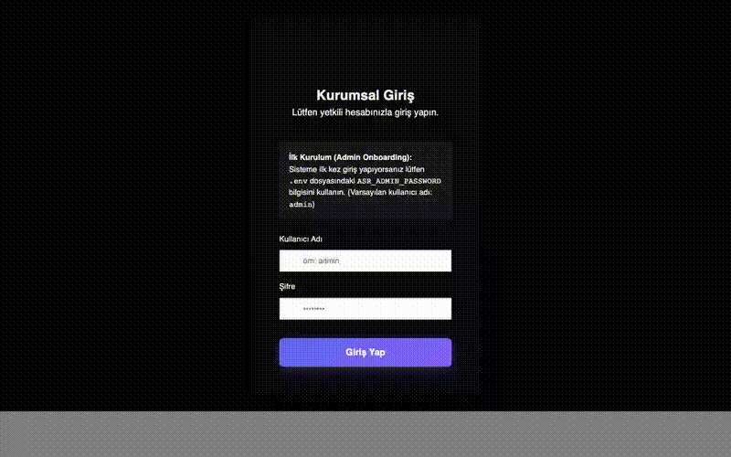
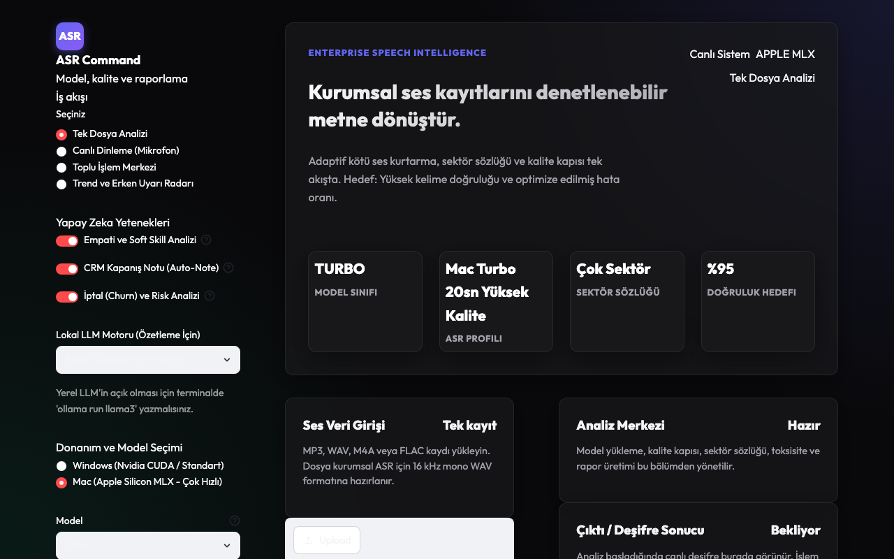
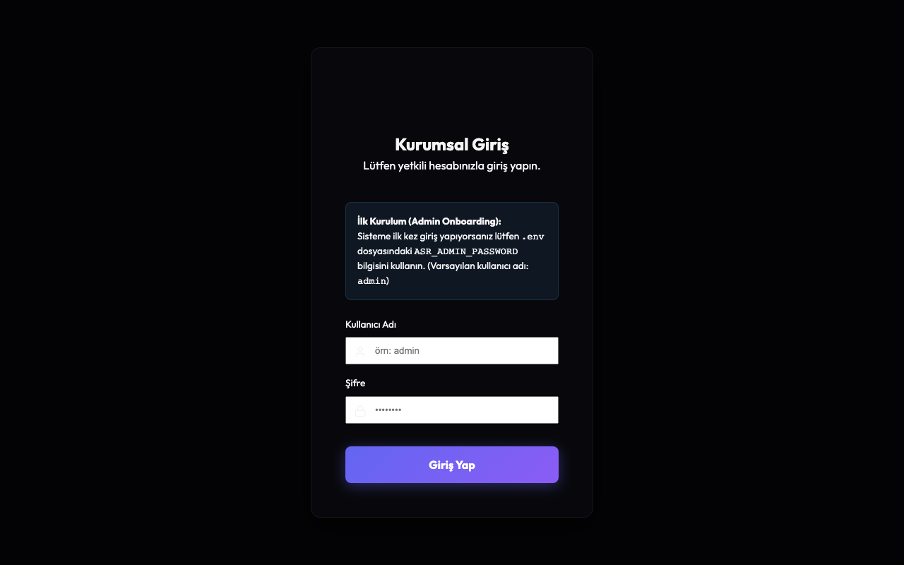
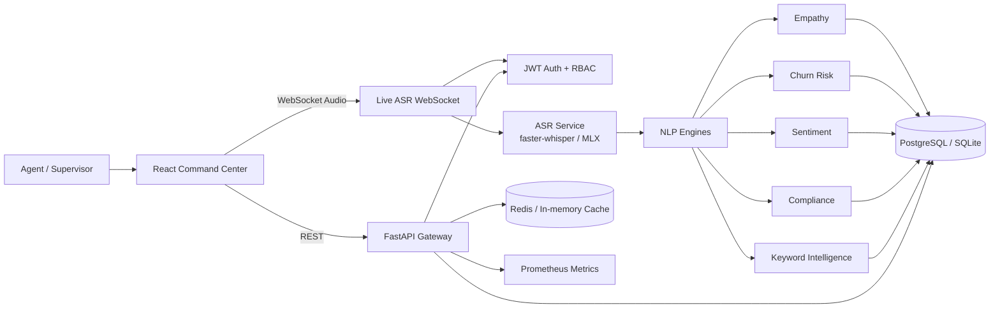

<div align="center">

# ASR-Pro

### Enterprise Speech Intelligence for Contact Centers

Turn live or recorded customer conversations into transcripts, compliance signals, churn risk, empathy scores, keyword alerts, and executive-ready analytics.

[](https://www.python.org/)
[](https://fastapi.tiangolo.com/)
[](https://react.dev/)
[](https://vitejs.dev/)
[]()
[]()
[](LICENSE)
[](https://github.com/ardamoustafa/ASR-Pro/stargazers)

<br />

<a href="#quick-start"><strong>Quick Start</strong></a>
 ·
<a href="docs/api.md"><strong>API Docs</strong></a>
 ·
<a href="docs/ARCHITECTURE.md"><strong>Architecture</strong></a>
 ·
<a href="README_TR.md"><strong>Turkish README</strong></a>
 ·
<a href="docs/DEPLOYMENT.md"><strong>Deploy</strong></a>

<br /><br />


</div>

---

## Why ASR-Pro Exists

Most speech-to-text projects stop at transcription. Enterprise teams need the next layer: **what happened, why it matters, which calls are risky, and what should be escalated now**.

ASR-Pro is a full-stack speech intelligence platform for modern contact centers. It combines real-time ASR, zero-shot NLP, compliance monitoring, keyword intelligence, trend analytics, and production deployment assets in one clean repository.

| What teams need | What ASR-Pro delivers |
|---|---|
| Real-time speech capture | WebSocket live ASR with authenticated streaming |
| Reliable call intelligence | Sentiment, churn, empathy, compliance, summaries, and keywords |
| Operational dashboards | React command center with analytics, alerts, and conversations |
| Enterprise controls | JWT auth, RBAC, rate limits, audit logging, security headers |
| Deployment confidence | Docker Compose, Helm, health checks, Prometheus metrics |
| Developer velocity | FastAPI, typed schemas, tests, linting, docs, seed scripts |

---

## Product Demo

### Live workflow



> Prefer video? Open the recorded walkthrough: [docs/assets/demo.webm](docs/assets/demo.webm)

### Core screens

| Command Center | Live ASR & Analysis | Trend Intelligence |
|---|---|---|
|  |  |  |

---

## Highlights

### Real-time ASR

- Authenticated WebSocket streaming at `/ws/live-asr`
- Challenge-response auth flow so JWT tokens are not exposed in URLs
- O(1)-style buffered audio handling to avoid repeated tiny re-transcriptions
- `faster-whisper` support with Apple Silicon MLX acceleration where available

### Enterprise NLP layer

- Sentiment analysis for customer frustration and escalation detection
- Churn-risk scoring for cancellation, complaint, and retention signals
- Empathy and soft-skill analysis for agent quality monitoring
- Compliance engine for required phrases, forbidden wording, and QA rules
- Keyword engine with exact, fuzzy, semantic, regex, and topic-aware matching

### Operational command center

- React 19 + Vite dashboard
- Zustand state management
- Recharts-based analytics
- Alert rules and active alert tracking
- Conversation history and detail views
- Live ASR control surface

### Production-ready backend

- FastAPI REST + WebSocket API
- SQLAlchemy 2.0 models and Alembic migrations
- SQLite for development, PostgreSQL for production
- Redis-ready caching
- Prometheus metrics at `/metrics`
- Docker and Helm deployment paths

---

## Architecture




Read the full technical breakdown in [docs/ARCHITECTURE.md](docs/ARCHITECTURE.md).

---

## Quality Gates

The current repository passes the main release checks:

```bash
ruff check asr_pro tests
ASR_TEST_NO_MODEL=1 pytest tests/ --cov=asr_pro --cov-report=term-missing -q
npm run lint
npm test
npm run build
npm audit --audit-level=moderate
pip-audit -r requirements.txt
```

Current verified status:

| Gate | Status |
|---|---|
| Python lint | Passing |
| Backend tests | Passing |
| Backend coverage | 88% |
| Frontend lint | Passing |
| Frontend tests | Passing |
| Production frontend build | Passing |
| npm audit | Passing |
| pip-audit | Passing |

Some heavy model tests can be skipped with `ASR_TEST_NO_MODEL=1` for fast CI. Run the full model suite before publishing production accuracy numbers.

---

## Quick Start

### 1. Clone

```bash
git clone https://github.com/ardamoustafa/ASR-Pro.git
cd ASR-Pro
```

### 2. Configure

```bash
cp .env.example .env
```

Set at least:

```bash
ASR_JWT_SECRET_KEY=<generate-a-strong-secret>
ASR_ADMIN_PASSWORD=<set-a-strong-admin-password>
POSTGRES_PASSWORD=<set-a-strong-db-password>
```

Generate a secure JWT key:

```bash
python -c "import secrets; print(secrets.token_hex(32))"
```

### 3. Run with Docker Compose

```bash
docker-compose up -d
```

Services:

| Service | URL |
|---|---|
| React Dashboard | http://localhost:5173 |
| FastAPI Swagger Docs | http://localhost:8000/api/docs |
| API Health | http://localhost:8000/api/v1/health |
| Prometheus Metrics | http://localhost:8000/metrics |

The legacy Streamlit ASR Lab is included for local experimentation but is no longer exposed as the primary public UI by default. The React dashboard is the main product surface.

---

## Local Development

```bash
pip install -r requirements.txt
npm install

cp .env.example .env
python -m asr_pro.db.seed

make dev
```

Useful commands:

```bash
make test        # backend tests with coverage
make lint        # ruff + mypy + bandit
make security    # bandit + pip-audit
npm test         # frontend tests
npm run build    # production frontend build
```

---

## API Snapshot

### Login

```bash
curl -X POST "http://localhost:8000/api/v1/auth/login" \
  -H "Content-Type: application/x-www-form-urlencoded" \
  -d "username=admin&password=$ASR_ADMIN_PASSWORD"
```

### Analyze text

```bash
curl -X POST "http://localhost:8000/api/v1/conversations/analyze-text" \
  -H "Content-Type: application/json" \
  -b cookies.txt \
  -d '{
    "text": "Faturam yanlış geldi, iptal etmek istiyorum.",
    "sector": "telecom"
  }'
```

### Live ASR WebSocket

```text
ws://localhost:8000/ws/live-asr
```

Protocol:

1. Client connects.
2. Server sends `{"type":"auth_required"}`.
3. Client sends `{"type":"auth","token":"..."}`.
4. Server sends `{"type":"auth_ok"}`.
5. Client streams audio chunks.
6. Server returns transcript segments.

See [docs/api.md](docs/api.md) for the full REST and WebSocket API.

---

## Security Model

ASR-Pro is designed around enterprise speech data, so the security baseline is intentionally strict:

- JWT auth with HttpOnly cookie support
- Secure cookie behavior in production, local-friendly behavior in development
- Password hashing with Passlib/bcrypt
- RBAC-ready user model
- Rate limiting on auth and write endpoints
- Security headers: HSTS in production, X-Frame-Options, X-Content-Type-Options, Referrer-Policy
- Audit logging for state-changing API calls
- WebSocket auth without tokens in query strings
- `.env`-based secret management with no production fallback secret

For responsible disclosure, read [SECURITY.md](SECURITY.md).

---

## Deployment

### Docker Compose

Docker Compose starts PostgreSQL, the FastAPI API, the React dashboard, Redis optional profile support, and the local ASR lab container.

```bash
docker-compose up -d
docker-compose logs -f api
```

### Kubernetes / Helm

The Helm chart includes backend deployment, service templates, secrets, ingress-ready values, Redis configuration, and HPA values.

```bash
helm upgrade --install asr-pro ./helm-chart \
  --namespace asr-pro \
  --create-namespace \
  --set secrets.jwtKey="<your-secret>" \
  --set secrets.adminPassword="<your-admin-password>"
```

Read [docs/DEPLOYMENT.md](docs/DEPLOYMENT.md) for production setup notes.

---

## Use Cases

### Contact Center QA

Automatically surface compliance misses, weak empathy signals, risky phrasing, and repeated customer pain points.

### Churn Prevention

Detect cancellation language, frustration, billing disputes, and escalation signals before the account is lost.

### Product Intelligence

Convert thousands of calls into trend signals for product, growth, CX, and operations teams.

### Compliance Monitoring

Track required disclosures, forbidden claims, and sector-specific wording with auditable evidence.

---

## Repository Map

```text
asr_pro/
  api/                 FastAPI app, routes, schemas, auth, WebSocket
  core/                NLP engines: sentiment, churn, empathy, compliance, keywords
  db/                  SQLAlchemy models, sessions, seed data
  services/            ASR and conversation services
src/
  pages/               React product screens
  components/          Reusable UI components
  api/                 Frontend API client
docs/
  ARCHITECTURE.md      System design
  DEPLOYMENT.md        Production deployment guide
  api.md               REST and WebSocket reference
helm-chart/            Kubernetes deployment chart
tests/                 Backend test suite
```

---

## Roadmap

- [x] Authenticated FastAPI backend
- [x] React command center
- [x] Live WebSocket ASR
- [x] Keyword, topic, trend, and alert engines
- [x] Docker Compose deployment
- [x] Helm chart foundation
- [x] Security and dependency audits
- [ ] Full production model benchmark report
- [ ] Multi-tenant SaaS mode
- [ ] Agent-assist recommendations
- [ ] Native SDK examples
- [ ] Hosted demo environment

---

## Contributing

Contributions are welcome. The best first contributions are:

- New sector dictionaries
- More Turkish call-center benchmark samples
- Additional compliance rule packs
- Frontend accessibility improvements
- E2E tests for live ASR and dashboard flows
- Deployment hardening for Kubernetes environments

Read [CONTRIBUTING.md](CONTRIBUTING.md) before opening a pull request.

---

## Star History

[](https://star-history.com/#ardamoustafa/ASR-Pro&Date)

---

## License

ASR-Pro is released under the [MIT License](LICENSE).

