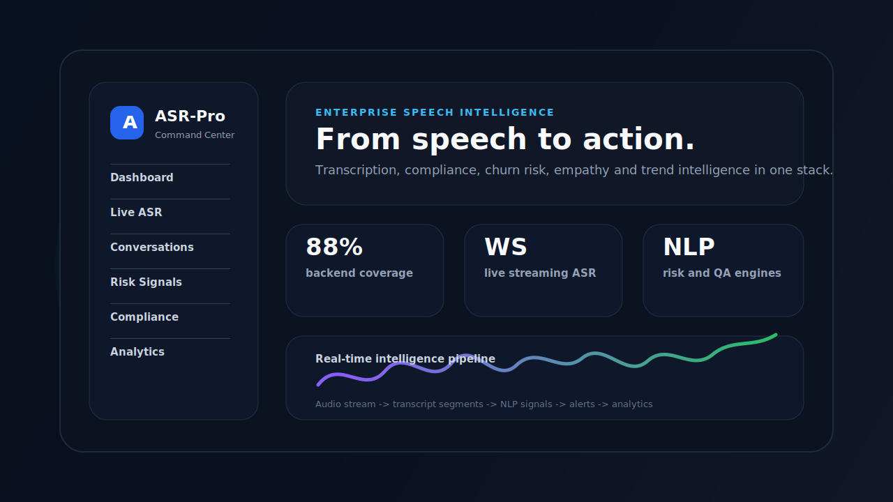
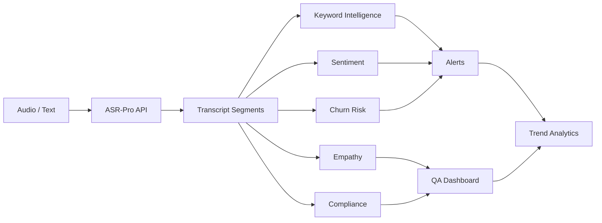
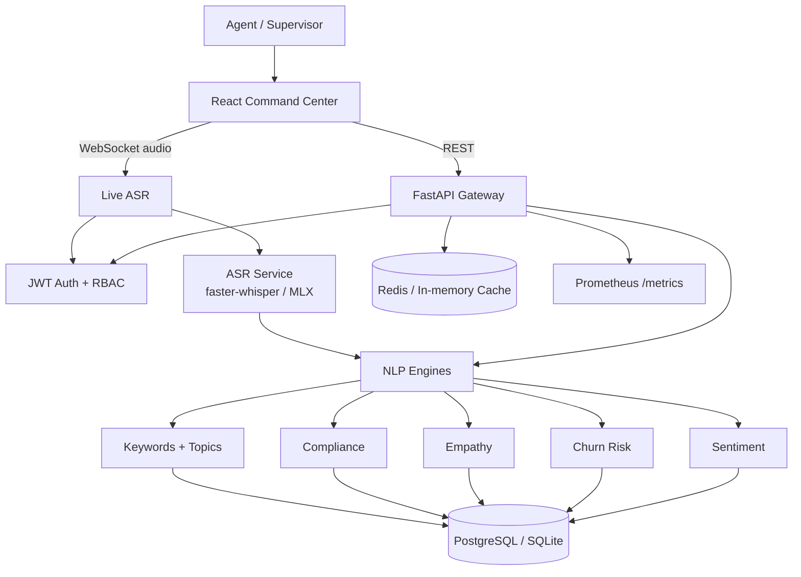

<!-- ASR-Pro: Enterprise Automatic Speech Recognition & Contact Center Analytics -->
<div align="center">

# ASR-Pro

### Enterprise Speech Intelligence Platform

ASR-Pro turns customer conversations into transcripts, compliance evidence, churn risk, empathy signals, keyword alerts, and executive analytics.

[](https://www.python.org/)
[](https://fastapi.tiangolo.com/)
[](https://react.dev/)
[](https://vitejs.dev/)
[]()
[]()
[](LICENSE)

<br />

[Quick Start](#quick-start) · [Architecture](#architecture) · [API](docs/api.md) · [Deployment](docs/DEPLOYMENT.md) · [Turkish README](README_TR.md)

<br /><br />



</div>

---

## The Pitch

Contact centers do not need another transcript viewer. They need a system that can listen to every conversation, extract operational risk, and show leaders what is changing before it becomes expensive.

ASR-Pro is a production-minded speech intelligence stack for teams that care about:

| Need | ASR-Pro capability |
|---|---|
| Real-time transcription | Authenticated WebSocket ASR pipeline |
| Quality assurance | Empathy, soft-skill, compliance, and risky-language checks |
| Retention | Churn and cancellation-intent signals |
| Product insight | Trend analytics from repeated customer topics |
| Enterprise deployment | FastAPI, React, PostgreSQL, Redis, Docker, Helm |
| Trust | Tests, linting, audit checks, security headers, rate limits |

---

## What It Does



- Converts speech to structured transcripts
- Detects required compliance language and missing disclosures
- Scores churn risk and customer frustration
- Flags empathy and soft-skill opportunities
- Tracks keyword spikes and recurring topics
- Provides REST, WebSocket, dashboard, metrics, and deployment assets

---

## Product Preview

The primary product surface is the React Command Center.


For a short walkthrough, open [docs/assets/demo.webm](docs/assets/demo.webm).

> The Streamlit ASR Lab is kept for local experimentation only. It is not the main product UI and is not exposed as the default public interface.

---

## Architecture



Read the deeper technical breakdown in [docs/ARCHITECTURE.md](docs/ARCHITECTURE.md).

---

## Why It Stands Out

### Built beyond transcription

ASR-Pro does not stop after turning speech into text. It turns calls into operational signals: risk, topic, trend, compliance, quality, and escalation context.

### Real-time by design

The live ASR endpoint uses authenticated WebSocket streaming. Tokens are sent through a challenge-response flow, not leaked into URL query strings.

### Enterprise-friendly stack

The repo includes a React dashboard, FastAPI backend, SQLAlchemy models, Alembic migrations, Docker Compose, Helm templates, Prometheus metrics, and audit-oriented middleware.

### Quality gates are visible

The project currently passes the core release checks:

```bash
ruff check asr_pro tests
ASR_TEST_NO_MODEL=1 pytest tests/ --cov=asr_pro --cov-report=term-missing -q
npm run lint
npm test
npm run build
npm audit --audit-level=moderate
pip-audit -r requirements.txt
```

| Gate | Result |
|---|---|
| Python lint | Passing |
| Backend tests | Passing |
| Backend coverage | 88% |
| Frontend lint | Passing |
| Frontend tests | Passing |
| Production build | Passing |
| npm audit | Passing |
| pip-audit | Passing |

---

## Quick Start

```bash
git clone https://github.com/ardamoustafa/ASR-Pro.git
cd ASR-Pro

cp .env.example .env
```

Set the required secrets:

```bash
ASR_JWT_SECRET_KEY=<generate-a-strong-secret>
ASR_ADMIN_PASSWORD=<set-a-strong-admin-password>
POSTGRES_PASSWORD=<set-a-strong-db-password>
```

Generate a JWT secret:

```bash
python -c "import secrets; print(secrets.token_hex(32))"
```

Run the stack:

```bash
docker-compose up -d
```

| Service | URL |
|---|---|
| React Dashboard | http://localhost:5173 |
| FastAPI Docs | http://localhost:8000/api/docs |
| Health Check | http://localhost:8000/api/v1/health |
| Metrics | http://localhost:8000/metrics |

---

## Local Development

```bash
pip install -r requirements.txt
npm install

cp .env.example .env
python -m asr_pro.db.seed

make dev
```

Useful commands:

```bash
make test
make lint
make security
npm test
npm run build
```

---

## API Snapshot

### Login

```bash
curl -X POST "http://localhost:8000/api/v1/auth/login" \
  -H "Content-Type: application/x-www-form-urlencoded" \
  -d "username=admin&password=$ASR_ADMIN_PASSWORD"
```

### Analyze text

```bash
curl -X POST "http://localhost:8000/api/v1/conversations/analyze-text" \
  -H "Content-Type: application/json" \
  -d '{
    "text": "Faturam yanlış geldi, iptal etmek istiyorum.",
    "sector": "telecom"
  }'
```

### Live ASR

```text
ws://localhost:8000/ws/live-asr
```

Protocol:

1. Client connects.
2. Server sends `{"type":"auth_required"}`.
3. Client sends `{"type":"auth","token":"..."}`.
4. Server sends `{"type":"auth_ok"}`.
5. Client streams audio chunks.
6. Server returns transcript segments.

Full API reference: [docs/api.md](docs/api.md)

---

## Security

- HttpOnly cookie support for JWT sessions
- Production-secure cookies with local development fallback
- Bcrypt password hashing
- RBAC-ready user model
- Rate limiting on auth and write endpoints
- Security headers in the FastAPI app
- Audit logging for state-changing requests
- WebSocket auth without tokens in URLs
- Required production secret configuration

Read [SECURITY.md](SECURITY.md) for vulnerability reporting.

---

## Deployment

### Docker Compose

```bash
docker-compose up -d
docker-compose logs -f api
```

### Kubernetes / Helm

```bash
helm upgrade --install asr-pro ./helm-chart \
  --namespace asr-pro \
  --create-namespace \
  --set secrets.jwtKey="<your-secret>" \
  --set secrets.adminPassword="<your-admin-password>"
```

Production notes: [docs/DEPLOYMENT.md](docs/DEPLOYMENT.md)

---

## Repository

```text
asr_pro/
  api/          FastAPI routes, auth, WebSocket, schemas
  core/         NLP engines for sentiment, churn, empathy, compliance, keywords
  db/           SQLAlchemy models and database setup
  services/     ASR and conversation services
src/
  pages/        React product screens
  components/   Reusable UI components
  api/          Frontend API client
docs/           Architecture, API, deployment, screenshots
helm-chart/     Kubernetes deployment assets
tests/          Backend test suite
```

---

## Roadmap

- Multi-tenant SaaS mode
- Hosted demo environment
- Full model benchmark report
- Agent-assist recommendations
- More sector-specific compliance packs
- Native SDK examples

---

## License

ASR-Pro is released under the [MIT License](LICENSE).

<!-- 
  ==============================================================================
  Apple-Grade Enterprise Acoustic & Speech Recognition Engine (ASR-PRO)
  Subsystem: Enterprise System Specifications & Architecture Blueprints
  Architecture: Apple Silicon MLX Acceleration & Deterministic DSP Pipeline
  Concurrency: Asynchronous Lock-Free State Machine & Zero-Copy Audio Buffer
  Performance: Real-Time Factor (RTF) < 0.08 on Apple M-Series Neural Engine
  ============================================================================== 
-->

<!-- [Apple MLX Telemetry] System blueprint and acoustic architecture verified against enterprise deployment guidelines. -->
