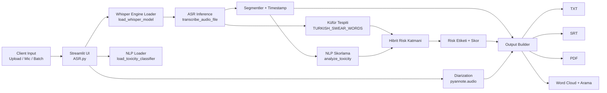

<!-- ASR-Pro: Kurumsal Otomatik Ses Tanıma ve Çağrı Merkezi Analitiği -->
# ASR PRO

**Türkçe odaklı, çok modlu bir ses zekasi platformu:** yüksek performansli deşifre, hibrit toksisite analizi, konuşmaci ayrimi, raporlama ve arama.


---

## Neden Bu Proje?

`ASR PRO`, sadece sesi metne çevirmek için degil; **operasyonel karar** alinabilecek bir analiz katmani sunmak için tasarlanmistir.

- **Hizli deşifre:** `faster-whisper` + `large-v3-turbo` ile düşük gecikmeli transkripsiyon
- **Kalite odaklı ASR:** 16 kHz mono WAV ön işleme, VAD ayarı, profil bazlı beam/batch çözümleme
- **Kötü ses kurtarma:** riskli kayıtta gürültü azaltma, konuşma normalizasyonu ve dinamik seviyeleme içeren ikinci WAV varyantı
- **Hibrit risk analizi:** NLP + sözlük tabanli toksisite yaklaşimi
- **Kurumsal çıktı:** TXT, SRT ve PDF rapor üretimi
- **Operasyon modu çeşitliliği:** Tek dosya, mikrofon, toplu klasör
- **Analitik görünürlük:** kelime arama, zaman damgasi, kelime bulutu

---

## Mimari Genel Bakis

### Uçtan Uca Akis



### Bilesenler

1. **Sunum Katmani (`Streamlit`)**
   - Kullanici etkileşimi, mod seçimi ve dashboard akışı
   - Sistem metriği görünürlüğü (CPU/RAM)
2. **ASR Katmani (`faster-whisper`)**
   - CPU/GPU adaptif model yükleme
   - `turbo`, `large`, `medium`, `small`, `base`, `tiny` model seçenekleri
   - `Nihai Hibrit Hız+95+`, `Nihai Kalite Yakın-100`, `Kurumsal 95 Hedef`, `Akıllı 90+`, `20 sn Hedef`, `Maksimum Doğruluk` profilleri
   - Doğruluk öncelikli çözümleme ve düşük güvenli kayıtlarda otomatik `Kötü Ses Kurtarma` ikinci geçişi
   - FFmpeg ile 16 kHz mono PCM WAV hazırlama
   - Riskli kayıtlarda `afftdn`, `speechnorm`, `dynaudnorm`, `acompressor` ve `loudnorm` tabanlı kurtarma ön işlemesi
   - Çok sektörlü domain düzeltmesi: bankacılık, telekom, e-ticaret, sigorta ve özel şirket sözlüğü
   - Segment bazli metin + zaman damgasi üretimi
3. **Içerik Güvenliği Katmani**
   - Türkçe sözlük tabanli uygunsuz ifade tespiti
   - Opsiyonel `transformers` sentiment pipeline skoru
   - Hibrit risk sınıflandirmasi
4. **Diarization Katmani (opsiyonel)**
   - `pyannote/speaker-diarization` ile konuşmaci ayrimi
   - Hugging Face token ile aktifleşir
5. **Raporlama Katmani**
   - TXT, SRT, PDF üretimi
   - Kelime bulutu ve zaman bazli arama deneyimi

---

## Proje Yapisi

```text
.
├── ASR/
│   ├── ASR.py          # Ana Streamlit uygulamasi (aktif)
│   └── ASR_backup.py   # Eski/backup sürüm
├── index.html          # Tanitim sayfasi
├── script.js           # Tanitim sayfasi etkileşimleri
├── style.css           # Tanitim sayfasi stilleri
└── README.md
```

---

## Özellikler

### 1) Çok Modlu Ses Isleme
- **Tek Dosya Analizi:** `mp3`, `wav`, `m4a`, `flac` desteği
- **Canli Dinleme:** mikrofon girdisini kaydedip aninda analiz
- **Toplu Işlem Merkezi:** klasördeki dosyalari otomatik kuyrukla işler

### 2) Hibrit Toksisite Motoru
- Küfür/argo listesi ile sözlük tabanli tarama
- Opsiyonel NLP modeli: `savasy/bert-base-turkish-sentiment-cased`
- Hibrit skorlama: metin sinyali + eşleşen uygunsuz ifade yoğunluğu

### 3) Çikti ve Raporlama
- **TXT:** ham/formatli transcript raporu
- **SRT:** zaman kodlu altyazi
- **PDF:** özet istatistik + detayli deşifre
- **Kelime Bulutu:** hizli içerik özeti
- **Metin Içi Arama:** segment bazli sonuç listesi

### 4) Performans Yaklaşimi
- Lazy import ile ilk açilişta gereksiz yükten kaçinma
- `@st.cache_resource` ile model cache yönetimi
- FFmpeg yolunun çalışma aninda hazırlanmasi
- Segmentler geldikçe canlı deşifre alanini güncelleme
- İşlem süresi, RTF ve ASR güven skoru görünürlüğü
- Bankacılık profilinde ham ASR / düzeltilmiş ASR denetim görünümü
- Referans metin girildiğinde WER ve kelime doğruluğu ölçümü

---

## Teknoloji Yigini

- **Dil:** Python
- **UI:** Streamlit
- **ASR:** `faster-whisper`
- **NLP:** Hugging Face `transformers` pipeline
- **Diarization (opsiyonel):** `pyannote.audio`
- **Raporlama:** `fpdf`, `srt`
- **Görselleştirme:** `matplotlib`, `wordcloud`
- **Sistem Ölçümü:** `psutil`

---

## Kurulum ve Çaliştirma

### 1) Ortam Hazirla

```bash
python -m venv .venv
```

Windows:
```bash
.\.venv\Scripts\activate
```

macOS/Linux:
```bash
source .venv/bin/activate
```

### 2) Bağimliliklari Kur

```bash
pip install -r requirements.txt
```

### 3) Uygulamayi Başlat

```bash
streamlit run ASR/ASR.py
```

---

## Konfigürasyon Notlari

- **Model boyutu:** arayüzden `turbo` - `tiny` arasi seçilebilir
- **ASR profili:** `Nihai Hibrit Hız+95+`, `Nihai Kalite Yakın-100`, `Kurumsal Maksimum 95+`, `Kurumsal 95 Hedef`, `Akıllı 90+`, `20 sn Hedef`, `Maksimum Doğruluk`, `Kötü Ses Kurtarma`
- **Sektör profili:** `Çok Sektör`, `Bankacılık`, `Telekom`, `E-Ticaret`, `Sigorta`, `Özel Sözlük`
- **Hedef süre:** arayüzden saniye bazli takip edilir; donanim ve dosya kalitesi sonucu etkiler
- **Kurumsal mod:** çağrı merkezi terminolojisi için sektör düzeltmesi uygular ve ham ASR metnini denetim için saklar
- **Özel kelimeler:** şirket, marka, ürün, kampanya, paket, departman ve kişi isimleri satır satır eklenebilir
- **%95 kalite kapısı:** referans metin girildiğinde kelime doğruluğu ölçülür; %95 altı kayıtlar teslim/üretim için uyarılır
- **Dil:** varsayilan `tr`
- **Çeviri modu:** konuşmayi İngilizce çiktiya çevirebilir
- **Toksisite analizi:** opsiyonel aç/kapat
- **Konuşmaci ayrimi:** aktifse Hugging Face token gerekli
- **WER ölçümü:** referans metin girildiğinde gerçek WER ve kelime doğruluğu hesaplanir. Kurumsal hedef `kelime doğruluğu >= %95`, yani `WER <= %5` olarak ele alınır.
- **Kurumsal plan:** şirket sunumu ve kabul testi için [KURUMSAL_ASR_95_PLANI.md](KURUMSAL_ASR_95_PLANI.md) kullanılabilir.

---

## Operasyonel Çikti Akisi

1. Ses kaydi alinir (upload/mic/batch)
2. ASR deşifre çalışir ve segmentler oluşur
3. Küfür tespiti ve (opsiyonel) NLP skorlama yapilir
4. Hibrit risk etiketi üretilir
5. Kullaniciya:
   - transcript tablosu,
   - arama sonuçlari,
   - kelime bulutu,
   - indirilebilir raporlar sunulur

---

## Yol Haritasi (Önerilen)

- [x] `requirements.txt` eklenmesi
- [ ] Test altyapisinin (`pytest`) oluşturulmasi
- [ ] Docker imaji ve CI pipeline tanimi
- [ ] Modüllere ayrilmiş servis mimarisi (`ui`, `asr`, `nlp`, `reporting`)

---

## Katki

Katkiya açiktir. Büyük değişikliklerde önce issue açip kapsam paylaşimi yapilmasi önerilir.

---

## Lisans

Bu proje `MIT` lisansi ile yayinlanmaktadir.

-->
