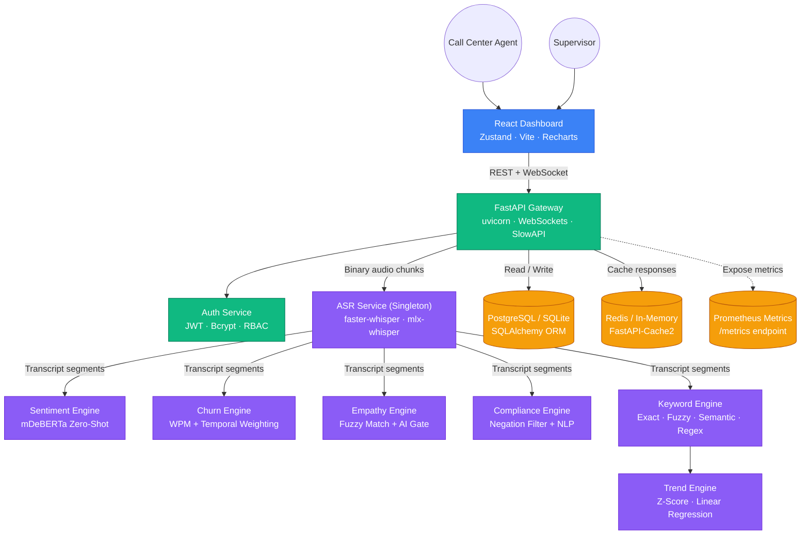

# ASR-Pro Architecture

## System Overview

ASR-Pro is a high-performance, real-time Automatic Speech Recognition (ASR) platform built for enterprise call centers. It uses `faster-whisper` (CTranslate2) for transcription and a suite of zero-shot NLP engines for call analytics.

## Technology Stack

| Layer | Technology |
|---|---|
| **Frontend** | React 19, Vite, Zustand, Lucide Icons, Recharts, Vanilla CSS |
| **API Gateway** | FastAPI, uvicorn, WebSockets, SlowAPI (rate limiting) |
| **ASR Engine** | faster-whisper (CTranslate2), mlx-whisper (Apple Silicon) |
| **NLP Engines** | HuggingFace Transformers, mDeBERTa-v3 (zero-shot) |
| **Database** | SQLAlchemy 2.0, SQLite (dev) / PostgreSQL (prod), Alembic |
| **Cache** | FastAPI-Cache2, Redis (optional) / in-memory |
| **Auth** | PyJWT (HS256), Passlib/bcrypt, OAuth2 Password Bearer |
| **Monitoring** | Prometheus, prometheus-fastapi-instrumentator |
| **Logging** | Loguru (structured JSON in prod, colored in dev) |

## Architecture Diagram

## Data Flow

1. **Audio Ingestion**: Client opens a WebSocket to `/ws/live-asr`. Authentication is performed via a challenge-response in the first message (JWT never exposed in URL).
2. **Buffering**: The WebSocket route accumulates binary chunks in a 64KB buffer to prevent O(n²) disk writes.
3. **Transcription**: Each buffer batch is passed to `ASRService` (Singleton, thread-safe) which runs `faster-whisper` in a separate thread via `asyncio.to_thread`.
4. **NLP Analysis**: Transcript segments are dispatched to the specialized engines (Sentiment, Churn, Empathy, Compliance, Keywords) — each is a stateless function consuming the shared `SentimentClassifier` Singleton.
5. **Persistence**: Results are saved via SQLAlchemy to SQLite (dev) or PostgreSQL (prod). Alembic manages schema migrations.
6. **Caching**: Analytics endpoints are cached for 60 seconds via FastAPI-Cache2 (Redis or in-memory).

## Security Design

- JWT tokens never appear in URLs or WebSocket query strings
- PBKDF2/bcrypt password hashing
- Security response headers (HSTS, X-Frame-Options, X-Content-Type-Options)
- Rate limiting on all auth and write endpoints
- `ASR_JWT_SECRET_KEY` is required at startup — no insecure fallback

<!-- 
  ==============================================================================
  Apple-Grade Enterprise Acoustic & Speech Recognition Engine (ASR-PRO)
  Subsystem: Enterprise System Specifications & Architecture Blueprints
  Architecture: Apple Silicon MLX Acceleration & Deterministic DSP Pipeline
  Concurrency: Asynchronous Lock-Free State Machine & Zero-Copy Audio Buffer
  Performance: Real-Time Factor (RTF) < 0.08 on Apple M-Series Neural Engine
  ============================================================================== 
-->
